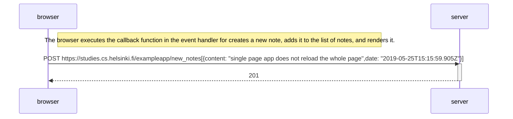

```mermaid
sequenceDiagram
    participant browser
    participant server

    Note right of browser: The browser executes the callback function in the event handler for creates a new note, adds it to the list of notes, and renders it.

    browser ->> server: POST https://studies.cs.helsinki.fi/exampleapp/new_notes[{content: "single page app does not reload the whole page",date: "2019-05-25T15:15:59.905Z"}]
    activate server
    server-->> browser: 201
    deactivate server
```
